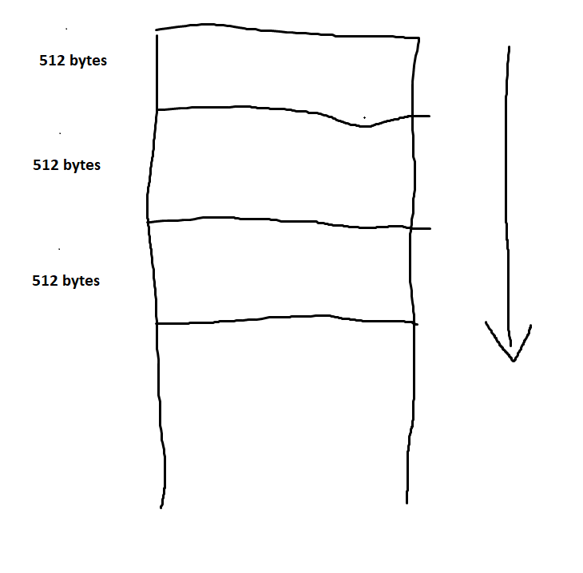

# The start

Today when endlessly doing nothing particular, I received a question from my mentor: "What is stack, and what is heap in memory?"

Having heard this, I stunned, trying to recollect the memory of that CS224 course I took because he recommended it himself to me. Ah, I remember what stack is, it stores local variables, arguments, metadata and return address of a function. But what the hell is heap anyway?

In the 2 years of me learning programming, the heap has always been something kind of a black box to me. Too afraid to open yet so versatile it appears everywhere I go. Like that Heap all pages in a database system lie in, or that heap data structure I have seen once and never want to learn it again. I'm not sure whether this heap in memory has anything to do with the data structure, but it sure will not be pleasant.

Regardless of my uneasiness with Heap, I scout through the web for like 10 seconds and recollect my thought. Right, it is a non-contagious, dynamically allocated memory segment that data scatters here and there. All too easy, though I'm not very sure about my answers as always. But he continues with another question: 

> Why store in heap but not stack?

Hmm, another twisty, open-ended question that I've long known he would ask in any conversation we're in. But that raises something in me, half of me wants to actually answer this question while the other half wants to answer the way history has shaped: **because they are the way they were**.

I could only think about why the topics of the question: **stack** and **heap**. What does he mean by that? Does he want to store everything in stack? The (ironically) architect in me - who really likes having multiple approaches - think about the scale that the designers of the past have to balance. I started defending by giving points like:

- The way stack works does not allow dynamic allocation
- How do you bring something like stack to store a data structure like a Go's slice, automatically allocate more memory when its capacity is surpassed?
- Using stack to store complex data structures will be more costly than on heap

But to my surprise, he proposed a data structure - one that is a combination of linked list and paging technique - to solve the problem of dynamic allocation. A block of 512 bytes each, has a reference to the next block and therefore forge a linked list.

The thing is, I couldn't understand the structure and the way that data structure works at all. The picture in my head is like this:

Sounds all alright, looks a bit like database pages, but how does this thing work at all?

Stack works by having a master function, running linearly in instruction form, and when it reaches a function call - basically a GOTO statement - it pushes its local variables, arguments together with a return address onto the stack, decrement the STACK POINTER, then goes to fetch those new local variables and arguments of the called function into registers again and continue this cycle.

But with this type of data structure, I can still imagine things to be the same, pushing and popping data onto/off the stack. But how does this prove to be dynamic? what if the data structure goes beyond 512 bytes? If the answer is it will be pushes off to another data block, then how does this differ from the original stack, with block size being one data word?

I still don't know if my argument conflicts somewhere, but I believed that is the reason why instead of having multiple data blocks of small size, why don't we have one huge data block, say like it spans half the memory allocated for a single process? And isn't that big block of data called "the heap"?

I say this without considering that the heap is dynamically allocated and pretty much the location where it is allocated is fragmented and scattered. But still I was proud of such mathematical and argumentative statement. 

The discussion has come to a point I think too much about why one thing should be the way it should be, but not considering the fact that why it shouldn't be the other way. Some flashbacks and thoughts about my current position as someone who does not have the slightest clues about argumenting.

Anyway, before going to take a shower, a thing came to my mind: Would that thing be a product of historical events? Like those choices that were way too famous that no one question their existences anymore? Java and JavaScript? Things like that?

Turned out, the final answer is it, C language is the one starting the whole concerto, it uses the Stack-Heap model and gets so infamous, now everybody sees it as kind of a standards, even me before the conversation.